# 👋 Hi, I'm Osama Ahmed

---

## 🧬 Featured Project: EpiNova Lab Portal

### 🔬 AI-Powered Breast Cancer Detection Platform

*Pioneering epigenetic research through machine learning and DNA methylation analysis*

---

### 🤖 AI/ML Tasks Completed

| Phase | Task | Status |
|:------|:-----|:------:|
| **Data Preparation** | Loaded & transposed methylation dataset (71 patients, 595K+ CpG sites) | ✅ |
| **Preprocessing** | Implemented median imputation + StandardScaler pipeline | ✅ |
| **Feature Selection** | ANOVA F-test to select top 100,000 discriminative CpG sites | ✅ |
| **Model Training** | Trained XGBoost binary classifier with 5-Fold Stratified CV | ✅ |
| **Hyperparameter Tuning** | Optimized learning rate, max_depth, n_estimators | ✅ |
| **Model Evaluation** | Achieved AUC ≥ 0.88, Accuracy ≥ 80% | ✅ |
| **Biomarker Extraction** | Identified significant CpG biomarkers (feature importance > 0) | ✅ |
| **Model Artifacts** | Saved model, imputer, scaler, selected features as `.pkl` files | ✅ |
| **Backend Integration** | Flask API endpoints for model inference | ✅ |
| **Frontend Integration** | React UI for predictions and report visualization | ✅ |

---

## 🎯 Project Overview

**EpiNova Lab Portal** is a comprehensive web application designed for **breast cancer detection** using advanced machine learning models trained on **DNA methylation data**. The platform enables researchers and clinicians to:

- 📤 Upload patient methylation samples (CSV/Excel)
- 🤖 Run AI-driven predictions using our proprietary **EpiNova AI** models
- 📊 Visualize detailed epigenetic analysis reports
- 📈 Track and manage samples through an intuitive dashboard

---

## 🔄 Prediction Flow Architecture

```mermaid
flowchart LR
    A[📤 Upload CSV] --> B[🔍 Data Validation]
    B --> C[⚙️ Preprocessing]
    C --> D{🧠 Model Selection}
    D --> E[100K Feature Model]
    D --> F[Full Feature Model]
    D --> G[Refined Model]
    E --> H[📊 Feature Alignment]
    F --> H
    G --> H
    H --> I[🧪 Imputation & Scaling]
    I --> J[🎯 XGBoost Prediction]
    J --> K[📈 Risk Assessment]
    K --> L[🔒 Database Storage]
    L --> M[📋 Report Generation]
```

### Pipeline Steps:
1. **Data Upload** → CSV/Excel with CpG methylation Beta values (0-1 scale)
2. **Validation** → Format verification and feature count check
3. **Preprocessing** → Missing value imputation (median) + StandardScaler normalization
4. **Feature Alignment** → Matches input data with model's expected ~597,000 CpG sites
5. **Model Prediction** → XGBoost binary classification
6. **Risk Assessment** → Generates confidence scores and risk levels (Low/Medium/High)
7. **Report Generation** → Interactive visualization with top predictive markers

---

## 🛠️ Technology Stack

| Category | Technologies |
|:--------:|:-------------|
| **Frontend** |     |
| **UI Components** |     |
| **Backend** |    |
| **AI/ML** |     |
| **Database** |  |
| **DevOps** |   |

---

## ✅ What We've Achieved

### 🏆 Project Milestones Completed

#### 🧠 Machine Learning & AI
| Achievement | Details |
|:------------|:--------|
| ✅ **Trained 3 XGBoost Models** | 100K features, Full (~590K CpGs), and Refined marker models |
| ✅ **Achieved ~89% AUC Score** | High-performing breast cancer detection from methylation data |
| ✅ **Feature Engineering Pipeline** | ANOVA F-test feature selection on 597,000+ CpG sites |
| ✅ **Cross-Validation** | 5-Fold Stratified CV with hyperparameter tuning |
| ✅ **Complete Preprocessing** | Median imputation + StandardScaler normalization |
| ✅ **Model Serialization** | Saved models, imputers, scalers, and feature lists (`.pkl` files) |

#### 🖥️ Full-Stack Web Application
| Achievement | Details |
|:------------|:--------|
| ✅ **React 18 Frontend** | Modern TypeScript-based UI with Vite 6 |
| ✅ **Flask REST API** | Complete backend with 15+ API endpoints |
| ✅ **JWT Authentication** | Secure login/logout with token-based auth |
| ✅ **SQLite Database** | Users, Samples, and Reports tables with relationships |
| ✅ **Real-time Updates** | DataSyncContext with 15-second polling |
| ✅ **58+ UI Components** | Shadcn/ui + Radix primitives for premium design |

#### 📊 Dashboard & Analytics
| Achievement | Details |
|:------------|:--------|
| ✅ **Dashboard Overview** | Live stats: Total Samples, Completed Today, Processing, Pending |
| ✅ **Sample Management** | Upload, track status, view history |
| ✅ **Interactive Reports** | Detailed epigenetic analysis with top CpG markers |
| ✅ **Analytics Charts** | Recharts visualizations for data insights |
| ✅ **Settings Page** | User profile, team management, API keys, notifications |

#### 🎨 UI/UX Design
| Achievement | Details |
|:------------|:--------|
| ✅ **Premium Dark Theme** | Modern glassmorphism aesthetic |
| ✅ **Micro-Animations** | Smooth transitions and loading states |
| ✅ **Responsive Design** | Works on desktop and tablet |
| ✅ **Drag-and-Drop Upload** | CSV/Excel file upload with validation |
| ✅ **Real-time Processing View** | Live progress tracking during predictions |

#### 🔧 DevOps & Infrastructure
| Achievement | Details |
|:------------|:--------|
| ✅ **Docker Support** | Containerized backend deployment |
| ✅ **Environment Configuration** | Secure `.env` management |
| ✅ **CORS Configuration** | Proper cross-origin request handling |
| ✅ **Firebase Setup** | Initial Firestore structure and security rules |
| ✅ **Git Version Control** | Complete project history |

---

## 🗃️ Database Schema

---

## 🖥️ UI Features

| Feature | Description |
|:-------:|:------------|
| 🏠 **Dashboard** | Real-time stats, pending/processing/completed samples overview |
| 📤 **Sample Upload** | Drag-and-drop CSV/Excel with validation |
| 🔄 **Processing View** | Live progress tracking with micro-animations |
| 📊 **Analytics** | Interactive charts with Recharts visualizations |
| 📋 **Reports** | Detailed epigenetic analysis with top CpG markers |
| 🌙 **Dark Mode** | Premium dark theme UI |
| 🔐 **Authentication** | JWT-based secure login system |
| ⚡ **Real-time Sync** | Auto-refresh every 15 seconds |

---

## 📊 ML Model Performance

| Model | Features | AUC Score | Target Accuracy |
|:------|:--------:|:---------:|:---------------:|
| **100K Feature Model** | 100,000 CpG sites | ~0.89 | ≥80% |
| **Full Feature Model** | ~590,000 CpGs | ~0.88 | ≥80% |
| **Refined Model** | Optimized markers | ~0.87 | ≥80% |

---

## 💡 Skills Demonstrated

### Technical Expertise

| Domain | Skills |
|:------:|:-------|
| 🎨 **Frontend** | React Hooks, Context API, TypeScript, Responsive Design, Component Architecture |
| ⚙️ **Backend** | REST API Design, JWT Authentication, Database Design, CORS Configuration |
| 🤖 **AI/ML** | Feature Engineering, Model Training, Cross-Validation, Hyperparameter Tuning |
| 🧬 **Bioinformatics** | DNA Methylation Analysis, CpG Site Processing, Epigenetic Biomarkers |
| 🏗️ **Architecture** | Full-Stack Development, MVC Pattern, Real-time Data Sync |
| 🔧 **DevOps** | Docker, Environment Management, Database Migrations |

---

## 🚧 Current Enhancements (In Progress)

> **Note:** This project is currently an **MVP (Minimum Viable Product)** designed to demonstrate capabilities to investors. After initial investor feedback, cloud services will be fully integrated.

### 🔥 Firebase Integration
- [ ] Firebase Authentication (replacing JWT)
- [ ] Firestore database migration
- [ ] Firebase Storage for sample files
- [ ] Real-time listeners replacing polling

### 🐘 PostgreSQL Migration
- [ ] Moving from SQLite to PostgreSQL for production scalability
- [ ] Database migration scripts
- [ ] Connection pooling implementation

### ☁️ Future Cloud Services (Post-MVP)
- [ ] AWS/GCP deployment
- [ ] Auto-scaling infrastructure
- [ ] Load balancing
- [ ] CDN for static assets
- [ ] Serverless functions for predictions

---

## 📊 Other Project: Data Analyst Portfolio

### 📈 COVID-19 Data Analysis Project

*End-to-end data analysis using SQL, Tableau, and Python*

| Part | Topic | Technologies | Status |
|:----:|:------|:-------------|:------:|
| **1** | SQL Data Exploration |  | ✅ Completed |
| **2** | Tableau Visualization |  | 🔄 In Progress |
| **3** | Data Cleaning in SQL |  | ⏳ Upcoming |
| **4** | Correlation in Python |   | ⏳ Upcoming |

### Skills Being Developed:
- **SQL**: Data extraction, joins, aggregations, CTEs, window functions
- **Tableau**: Interactive dashboards, data storytelling, visual analytics
- **Python**: Pandas, correlation analysis, data visualization with Matplotlib/Seaborn

---

## 🚀 Roadmap

---

## 📫 Connect With Me

---

### 💼 Open for Opportunities

*Interested in AI, Data Analysis and Software Development*

---

*⭐ If you find my work interesting, please consider starring my repositories!*

